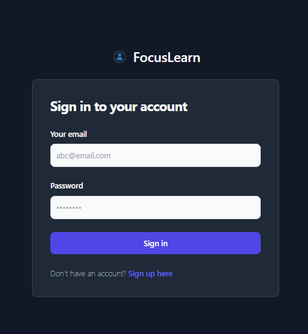
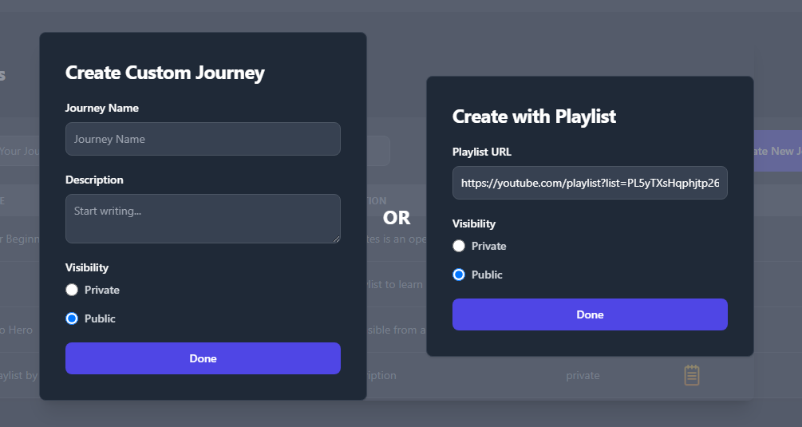
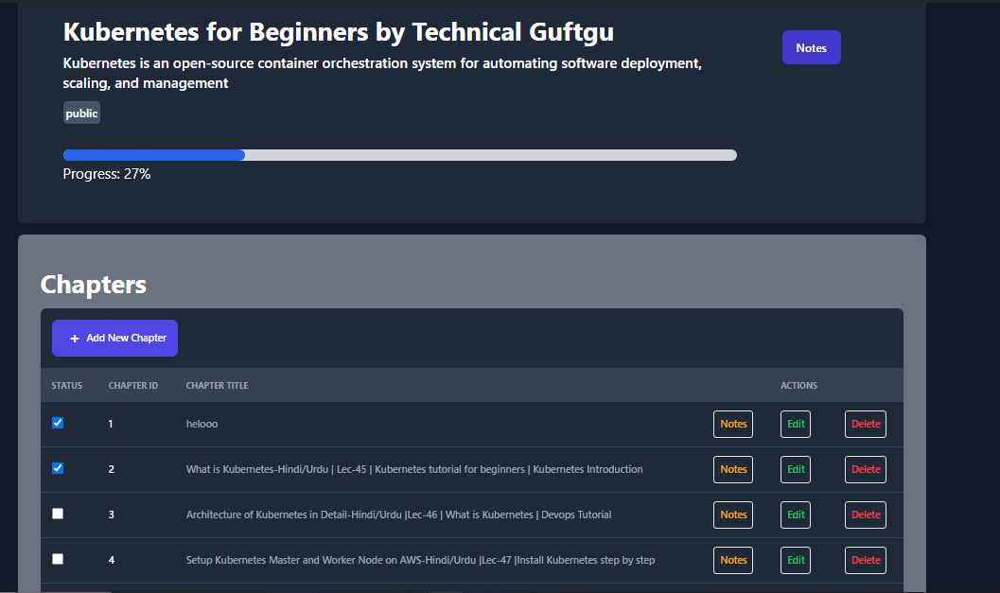
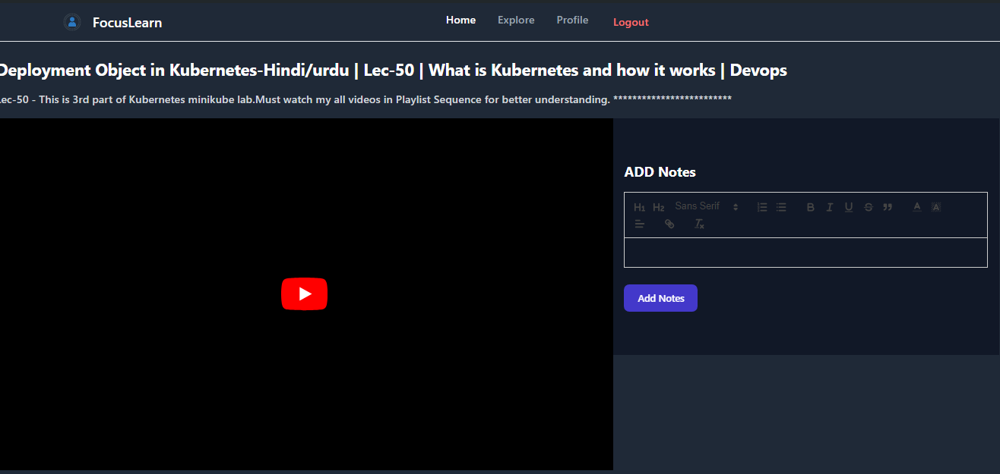
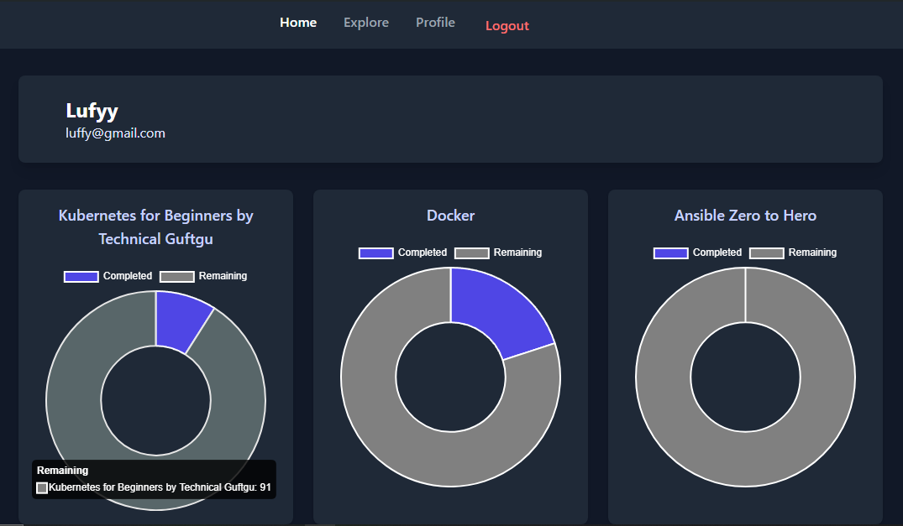
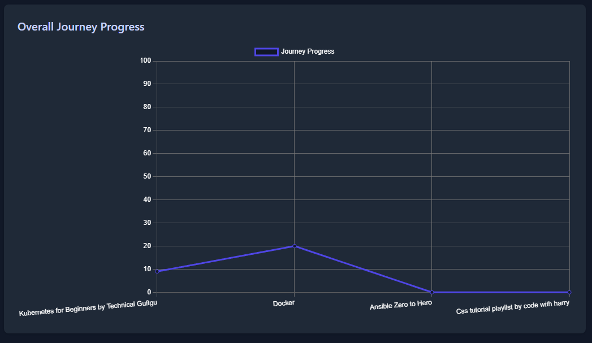
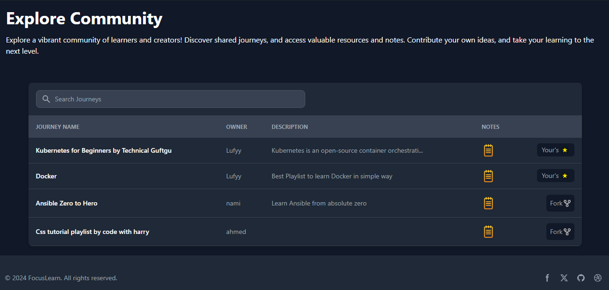

# Focus Learn

## Description

This project is a comprehensive platform designed to create and  manage educational materials efficiently. It provides a unified solution for users seeking a distraction-free learning environment, enabling easy management of educational content, notes, and personal progress. The platform includes several key features:

- **User Authentication**: Secure registration and login system to manage user accounts and access controls.

### Login Page


- **Journey Management**: Allows users to create their own journeys and can add youtube videos, orelse just add url of youtube playlist it will automatically provides you list of chapters.
### Create New Journey


### Journey Page



- **Video Playback**: Integrated video player to view youtube videos without the distractions typically found on platforms like YouTube and beside which you can also take notes.

- **Note-Taking**: Users can add and download notes related to their journeys, ensuring all important information is easily accessible.
### Video Player and Notes Taking



- **Profile Dashboard**: Provides an overview of user progress with visualizations such as charts and graphs.

### Progress Charts


### Overall Progress Graph


- **Fork Other's Journeys**: You can also fork other's journeys to your's which are set to public and other's can also fork your's.


### Forking Journeys



### Journey Forking

Users can:

- **Fork Journeys**: Duplicate public journeys to customize and tailor the content for personal use or further study.
- **Manage Forks**: Keep track of their own versions of journeys, separate from the original, while still retaining access to the source material.

## Setup

The recommended way to run the full project locally is with Docker Compose. This starts MySQL, the backend API, and the frontend app together.

### Prerequisites

Make sure you have the following installed:

- Docker Desktop
- Git
- Node.js 20+ and npm, only if you want to run commands outside Docker

### Clone the repository

```bash
git clone https://github.com/mdnumanraza/focusLearn.git
cd focusLearn
```

### Run with Docker Compose

From the project root, run:

```bash
docker compose up --build
```

After startup, open:

- Frontend: `http://localhost:5173`
- Backend: `http://localhost:5000`
- API base URL: `http://localhost:5000/api/v1`

The Compose stack includes:

- `focus-learn-mysql` on port `3306`
- `focus-learn-backend` on port `5000`
- `focus-learn-frontend` on port `5173`

### YouTube API key setup

Playlist import requires a YouTube Data API v3 key. In `docker-compose.yml`, replace the placeholder value:

```yaml
YT_KEY: your-api-key
```

with your real key:

```yaml
YT_KEY: your-real-youtube-api-key
```

Then restart the backend container:

```bash
docker compose restart backend
```

If the key is still set to `your-api-key`, playlist import will return `YouTube API key is not configured`.

### Stop the containers

```bash
docker compose down
```

### Reset the database

This removes the MySQL Docker volume and recreates the database from `api/table.sql`.

```bash
docker compose down -v
docker compose up --build
```

### Inspect the Docker database

Show databases:

```bash
docker exec focus-learn-mysql mysql -uroot -e "SHOW DATABASES;"
```

Show tables:

```bash
docker exec focus-learn-mysql mysql -uroot --database=focuslearn-DB -e "SHOW TABLES;"
```

View table data:

```bash
docker exec focus-learn-mysql mysql -uroot --database=focuslearn-DB -e "SELECT * FROM users;"
docker exec focus-learn-mysql mysql -uroot --database=focuslearn-DB -e "SELECT * FROM journeys;"
docker exec focus-learn-mysql mysql -uroot --database=focuslearn-DB -e "SELECT * FROM chapters;"
docker exec focus-learn-mysql mysql -uroot --database=focuslearn-DB -e "SELECT * FROM notes;"
```

Open an interactive MySQL shell:

```bash
docker exec -it focus-learn-mysql mysql -uroot --database=focuslearn-DB
```

### Verify the project

Run the API smoke test while the Docker containers are running:

```bash
node api-test.js
```

Expected result:

```text
=== SUMMARY: 35 passed, 0 failed ===
```

Build the frontend locally:

```bash
cd client
npm run build
```

Validate Docker Compose configuration:

```bash
docker compose config
```

### Commit and push changes

Before committing, check the working tree:

```bash
git status --short
git diff --check
```

Stage the project changes:

```bash
git add api/controllers/auth.js api/controllers/chapterController.js api/controllers/journeys.js api/controllers/noteController.js api/controllers/playlistJourney.js api/controllers/userController.js api/index.js api/models/journeyModel.js api/routes/users.js client/src/Api/chapters.js client/src/Api/index.js client/src/Api/journeys.js client/src/Api/notes.js client/src/App.jsx client/src/Components/forms/AddNotes.jsx client/src/Pages/Explore.jsx api-test.js api/.dockerignore api/Dockerfile client/.dockerignore client/Dockerfile docker-compose.yml readme.md
```

Commit and push:

```bash
git commit -m "Fix auth security, ownership checks, and add Docker setup"
git push
```

## Usage

### Authentication

- **Login/Register**: Navigate to `/auth` to login if you don't have account click on signup.

### Managing Journeys

- **Explore Journeys**: View and explore public journeys on the `/explore` page.
- **Fork Journeys**: Fork a journey to your account using the 'Fork' button.


### Profile Management

- **View Profile**: View your profile on the `/profile` page.
- **Track Progress**: Visualize your learning progress with charts and graphs.

## Contributing

If you'd like to contribute to the project, please fork the repository and submit a pull request.


